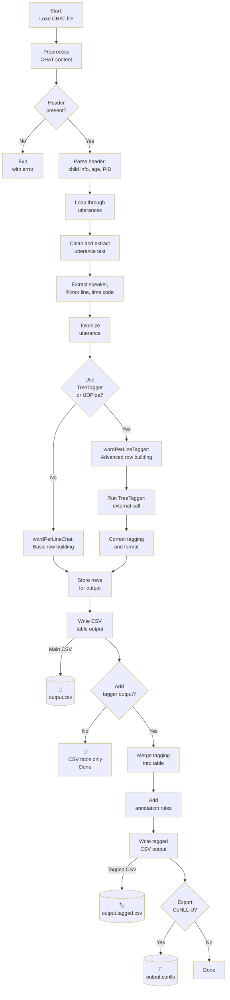

# Processing CHILDES Chat format

Achim Stein, DFG FOR 5157 "SILPAC", May 2025

## Convert Chat to Table

### childes.py

Structure of the script:

```mermaid
%%{ init: { "theme": "default", "themeVariables": { "nodeBkg": "#fff7c0", "nodeBorder": "#c9b458" } } }%%
flowchart TD
    A[Start:<br>Load CHAT file] --> B[Preprocess<br>CHAT content]
    B --> C{Header<br>present?}
    C -- No --> D[Exit<br>with error]
    C -- Yes --> E[Parse header:<br>child info, age, PID]
    E --> F[Loop through<br>utterances]

    F --> G[Clean and extract<br>utterance text]
    G --> H[Extract speaker,<br>%mor line, time code]
    H --> I[Tokenize<br>utterance]

    I --> J{Use<br>TreeTagger<br>or UDPipe?}
    J -- No --> K[wordPerLineChat:<br>Basic row building]
    J -- Yes --> L[wordPerLineTagger:<br>Advanced row building]
    L --> M[Run TreeTagger:<br>external call]
    M --> N[Correct tagging<br>and format]

    K --> O[Store rows<br>for output]
    N --> O

    O --> P[Write CSV<br>table output]
    P -->|Main CSV| P1[(📄 <br>output.csv)]

    P --> Q{Add<br>tagger output?}
    Q -- No --> R[🔢<br>CSV table only<br>Done]
    Q -- Yes --> S[Merge tagging<br>into table]
    S --> T[Add<br>annotation rules]
    T --> U[Write tagged<br>CSV output]
    U -->|Tagged CSV| U1[(🏷️<br>output.tagged.csv)]

    U --> V{Export<br>CoNLL-U?}
    V -- Yes --> W1[(🌳 <br>output.conllu)]
    V -- No --> W[Done]
```
