# Processing CHILDES data

Achim Stein, May 2025

This tutorial provides a detailed introduction to processing French CHILDES data using the `childes.py` script, developed in project H2 of the DFG research unit [SILPAC](https://silpac.uni-mannheim.de) (FOR 5157). The goal is to extract linguistic information from CHAT transcripts and convert them into structured, word-level data tables suitable for linguistic analysis.

## Overview

The `childes.py` script converts CHAT-format transcripts into a tabular format (CSV), where each word is listed on a separate line along with associated metadata such as the speaker, age, part-of-speech tags, and more.

The `dql.py` script provides additional functions for dependency parsed corpora. It applies Grew-style dependency queries to a CoNLL-U corpus. It can merge the output with the tabular format created by `childes.py`.

**Caveat**: These scripts were written by a linguist. They have been applied successfully to French Childes data on macOS and Linux. Use them with caution on your own data.

### From CHAT to CSV

`childes.py` supports two modes of analysis:

- **Default mode (without TreeTagger)**: Utilizes the morphological annotations provided in `%mor` lines within the original CHAT files.
- **Tagger mode (with TreeTagger)**: Replaces CHAT-based annotations with POS tags and lemmas generated by TreeTagger. The tagger is called by the script, but other tools can be used instead.
- Optionally, the tool produces CoNLL-U file format for **dependency parsing**.

The flowchart gives an overview of the structure and main functions.

```mermaid
%%{ init: { "theme": "default", "themeVariables": { "nodeBkg": "#fff7c0", "nodeBorder": "#c9b458" } } }%%
flowchart TD
    A[Start:<br>Load CHAT file] --> B[Preprocess<br>CHAT content]
    B --> C{Header<br>present?}
    C -- No --> D[Exit<br>with error]
    C -- Yes --> E[Parse header:<br>child info, age, PID]
    E --> F[Loop through<br>utterances]

    F --> G[Clean and extract<br>utterance text]
    G --> H[Extract speaker,<br>%mor line, time code]
    H --> I[Tokenize<br>utterance]

    I --> J{Use<br>TreeTagger<br>or UDPipe?}
    J -- No --> K[wordPerLineChat:<br>Basic row building]
    J -- Yes --> L[wordPerLineTagger:<br>Advanced row building]
    L --> M[Run TreeTagger:<br>external call]
    M --> N[Correct tagging<br>and format]

    K --> O[Store rows<br>for output]
    N --> O

    O --> P[Write CSV<br>table output]
    P -->|Main CSV| P1[(📄 <br>output.csv)]

    P --> Q{Add<br>tagger output?}
    Q -- No --> R[🔢<br>CSV table only<br>Done]
    Q -- Yes --> S[Merge tagging<br>into table]
    S --> T[Add<br>annotation rules]
    T --> U[Write tagged<br>CSV output]
    U -->|Tagged CSV| U1[(🏷️<br>output.tagged.csv)]

    U --> V{Export<br>CoNLL-U?}
    V -- Yes --> W1[(🌳 <br>output.conllu)]
    V -- No --> W[Done]
```


#### Requirements

- Python, with the libraries required by the script(s)
- Optional, if you use TreeTagger: From the [Treetagger](https://www.cis.uni-muenchen.de/~schmid/tools/TreeTagger) website, download the `tree-tagger` binary for your system and a suitable parameter file. For French, we used perceo-spoken-french-utf.par, trained on spoken French.

#### Preparing Data

Childes files in Chat format begin with a header, in which lines initiate with '@':

```
@UTF8
@PID:	11312/c-00028159-1
@Begin
@Languages:	fra
@Participants:	CHI Marie Target_Child , MOT Mother , FAT Father
@ID:	fra|Geneva|CHI|1;08.26||||Target_Child|||
etc.
```

`childes.py` needs to read the header to include the metadata of the recordings. It then extracts the following data lines and adds the metadata to each row of the output.  Chat data looks like so:

```
*CHI:	le cocodicoda@c .
%mor:	det:art|le&m&sg chi|cocodicoda .
%com:	nom d'une chanson; Marie chante des variations sur le mot .
*CHI:	non papa .
%mor:	co|non=no n|papa&m .
```

Each utterance (here: `*CHI`) is tokenised. The script creates one output row for each token.  The original morphological annotation (`%mor`) is processed, unless you use the tagger option to add your own part-of-speech tagging.  Given the inconsistencies and errors in the Chat files, I recommend to use TreeTagger (or any other tagger) for more transparent and consistent output.

If you have more than one Chat file, just concatenate them.  The script will identify each new file based on its header.

1. Concatenate all `.cha` files from a single project into one file:

   ```bash
   cat *.cha > childes-all.cha
   ```

2. Ensure TreeTagger is installed and configured if you plan to use the `-p` option.

## Basic Usage

Run the script on the concatenated file. Here are some usage examples:

- **Using only CHAT `%mor` annotations**:
  ```bash
  python childes.py childes-all.cha
  ```

This creates a csv table with one row per token. Since meta information is added to each row, the file is highly redundant.

In practical use, the table will be reduced to specific rows, for example verb tokens to analyse sentence / predicate structures.

Comment on some of the columns:

- **utt_id**: unique ID per token, combining PID of the Chat file, utterance number and word number.  This ID is required for all subsequent merging processes (e.g. adding of parser output)
- **speaker**: 3-letter code for a proper name or a function (CHI(ld), FAT(her) etc.).
- **child_project**: combines the child's name with the three initial letters of the project (Marie_Gen = Marie, Geneva project)
- **child_other**: speaker (C = child, X = other). Others can be caretakers, other involved adults or children.
- **age**: age of child, original format year;month.day:  YY;MM.DD (present only for speaker == child)
- **age_days**: age in days, calculated from 'age', copied from children to other speakers, so that age-dependent changes in adult speech can be analysed.
- **time_code**: file headers can contain a code for retrieving the recorded scene on audio or video media

<pre>
```csv
utt_id	utt_nr	w_nr	speaker	child_project	child_other	age	age_days	time_code	word	lemma	pos	features	annotation	utterance	utt_clean	utt_tagged	annot_refl	annot_dat	annot_clit	annot_mod	annot_particle
28159_u1_w1	1	1	FAT	Marie_Gen			634		alors	alors	adv		NO 	alors Marie (.) qu'est ce que tu veux faire ?							
28159_u1_w2	1	2	FAT	Marie_Gen			634		Marie	Marie	n:prop		NO 	alors Marie (.) qu'est ce que tu veux faire ?							
28159_u1_w3	1	3	FAT	Marie_Gen			634		,	être	pro:rel|que$v:aux	PRES&3s	NO 	alors Marie (.) qu'est ce que tu veux faire ?							
28159_u1_w4	1	4	FAT	Marie_Gen			634		qu'est	ce	pro:dem		NO 	alors Marie (.) qu'est ce que tu veux faire ?							
28159_u1_w5	1	5	FAT	Marie_Gen			634		ce	que	adv		NO 	alors Marie (.) qu'est ce que tu veux faire ?							
28159_u1_w6	1	6	FAT	Marie_Gen			634		que	tu	pro:subj		NO 	alors Marie (.) qu'est ce que tu veux faire ?							
28159_u1_w7	1	7	FAT	Marie_Gen			634		tu	vouloir	v:mdl	PRES&12s	NO 	alors Marie (.) qu'est ce que tu veux faire ?							
28159_u1_w8	1	8	FAT	Marie_Gen			634		veux	faire	v:mdllex	INF	NO 	alors Marie (.) qu'est ce que tu veux faire ?							
28159_u1_w9	1	9	FAT	Marie_Gen			634		faire		?		NO 	alors Marie (.) qu'est ce que tu veux faire ?							
28159_u1_w10	1	10	FAT	Marie_Gen			634		?				NO 	alors Marie (.) qu'est ce que tu veux faire ?							
```
</pre>

`-p <parameters>` launches the TreeTagger annotation.
- The script will create a temporary file ('tagthis.tmp')
- The tagger will analyse it and store the result in 'tagged.tmp'.
- The script will merge the result into the csv table, overwriting/filling columns pos and lemma.

- **Using TreeTagger for tagging**:
  ```bash
  python childes.py -m VER --pos_utterance VER -p perceo-spoken-french-utf.par childes-all.cha
  ```

`--tagger_output` adds a column 'utt_tagged' containing the complete sentence with tags and lemmas appended to each token (`token_<pos>=lemma token_<pos>=lemma ...`). Use it if you plan to use regular expression matches in your R script.

> allez_VER:impe=aller viens_VER:impe=venir ._SENT=. 

- **Adding tagged utterance strings to the output**:
  ```bash
  python childes.py -m VER --pos_utterance VER --tagger_output -p perceo-spoken-french-utf.par childes-all.cha
  ```

- **Applying custom annotation rules**:
  ```bash
  python childes.py -m VER --add_annotation --tagger_output --pos_utterance VER -p perceo-spoken-french-utf.par childes-all.cha
  ```

## Annotation Rules

If `--add_annotation` is specified, custom rules defined in the `tag_analyser.py` file are used to annotate clitics, reflexives, modals, etc. These rules are based on regular expressions applied to the tagged string (format: `word_POS=lemma`).

> Note: For complex or more accurate annotation, consider parsing the corpus first and applying rules to the dependency trees instead.

## Dependency Parsing with UDPipe

### Option 1: Append CoNLL-U columns during processing

```bash
python childes.py --conllu --ud_pipe french -p perceo-spoken-french-utf.par childes-all.cha
```

This option is slow (calls the API for every utterance), and should only be used for small files.

### Option 2: Generate CoNLL-U for external parsing

```bash
python childes.py --conllu -p perceo-spoken-french-utf.par childes-all.cha
```

Then parse `parseme.conllu` externally using UDPipe or another dependency parser:

```bash
curl -F data=@parseme.conllu  -F model=french -F tagger= -F parser= -F input=conllu https://lindat.mff.cuni.cz/services/udpipe/api/process | python -c "import sys,json; sys.stdout.write(json.load(sys.stdin)['result'])" > udpiped.conllu
```

### Handling Large Files

If UDPipe fails due to file size:

```bash
conll-util.py -S 10000 parseme.conllu
bash call-udpipe.sh
cat udpiped-parseme_* > udpiped.conllu
rm parseme_* udpiped-parseme_*
```

## Merging Parsed Data

### Add CoNLL-U to CSV table:

```bash
python3 merge-csv-conllu.py childes-all.cha.tagged.csv udpiped.conllu out.conllu
```

### Enrich CoNLL-U with CSV columns:

```bash
python3 merge-csv-conllu.py --enrich_conllu speaker,age_days childes-all.cha.tagged.csv udpiped.conllu out.conllu
```

## Dependency Query Language (dql.py)

Use the `dql.py` script to apply Grew-style dependency queries to a CoNLL-U corpus:

```bash
dql.py <query file> <conllu file> [--coding_only] [> output.conllu]
```

Use `--print_text` to output only text with optional highlights. Codings are inserted in the metadata of each CoNLL-U sentence.

### Merging codings into CSV

```bash
dql.py --merge childes-all.cha.tagged.csv childes-all.coded.conllu
```

To assign the coding to the head node:

```bash
dql.py --merge childes-all.cha.tagged.csv childes-all.coded.conllu --code_head
```

## Best Practices
- Always check for `INDEX ERROR` messages during processing.
- Separate attributes if multiple codings may occur (e.g., `acc_clitic`, `dat_clitic`).
- Use the [Grew online tool](https://universal.grew.fr/) for debugging queries.

## Conclusion
This script provides a versatile and extensible way to extract and annotate French CHILDES data. While some implementations remain rough (e.g., manual annotation rules), the tool is fully functional and provides a robust foundation for corpus-based morphosyntactic research.

Let me know if you want this saved to a file or converted to PDF.